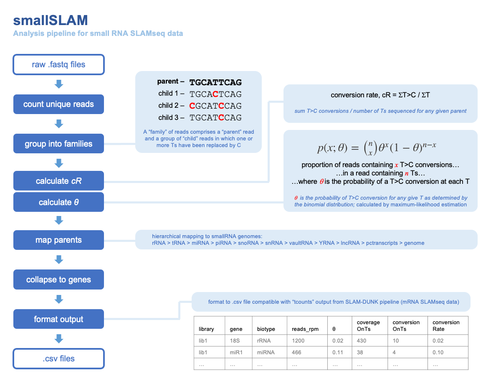

# smallSLAM

## Introduction 

smallSLAM is an analysis pipeline for small RNA SLAMseq data.  

[SLAMseq](https://www.nature.com/articles/nmeth.4435) is a method for detecting metabolic labelling in RNA.  4-thiouridine is used to label RNA and then RNA is treated with an alkylating agent (iodoacetamide).  During the reverse transcriptase step of RNA library preparation, bulky alkyl groups interfere with Watson-Crick base-pairing so that sites of 4TU incorporation are marked by T>C conversions in the final RNAseq dataset.  

Existing analysis pipelines are capable of mapping and quantifying T>C conversions in large RNA molecules (e.g. [SLAM-DUNK pipeline for mRNA](https://t-neumann.github.io/slamdunk/)).  

The smallSLAM pipeline has been designed to quantify and map T>C conversions in small RNA SLAMseq datasets.  These require a different approach to T>C quantification (due to a high proportion of duplicated reads and a low number of Ts per read) and a mapping approach that is optimised for small RNA species.  

Our general approach is shown here:

## Implementation

We will add additional documentation in late 2021.  
